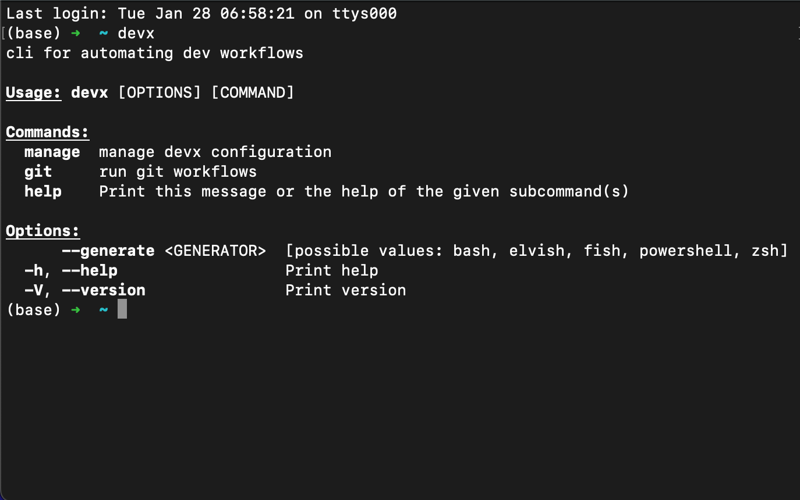

# devx

cli for automating my dev workflows. built in pure rust 🦀



## install:

1.  run the following command to install devx (note: requires `curl` and sudo access):

    ```shell
    curl -sSL https://raw.githubusercontent.com/ajndkr/devx/main/install.sh -o install.sh \
    && sh install.sh && rm install.sh
    ```

2.  run `devx help` to verify installation and list available commands

3.  run `devx manage uninstall` to remove devx

## development:

### pre-requisites:

1.  install [rust](https://www.rust-lang.org/tools/install)

2.  setup project:

    ```shell
    make init
    ```

### getting started:

1.  run code ci checks (formatting & linting):

    ```shell
    make ci
    ```

2.  test changes:

    ```shell
    make install
    ```

3.  clean up:

    ```shell
    make clean
    ```
